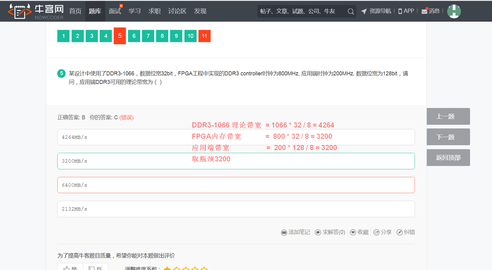

## 笔试知识点汇总

1. [DDR3 内存带宽计算](http://blog.chinaunix.net/uid-14214482-id-3220464.html)
    
2. [校招基础——存储器](https://www.icode9.com/content-4-735054.html)
3. [数电基础：时序逻辑电路的时序分析](https://blog.csdn.net/qq_26652069/article/details/90756790)
4. [聊一聊CRC算法的硬件电路实现：串行电路和并行电路](http://www.elecfans.com/d/892471.html)
5. [【笔试解析】2020华为海思校招芯片岗笔试](https://sourl.cn/RZtyvc)
