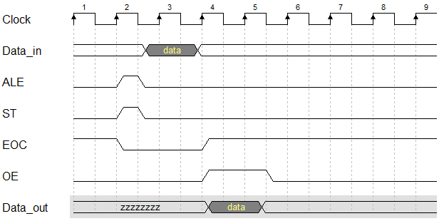
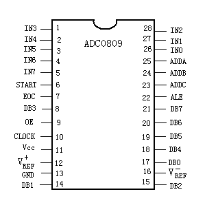
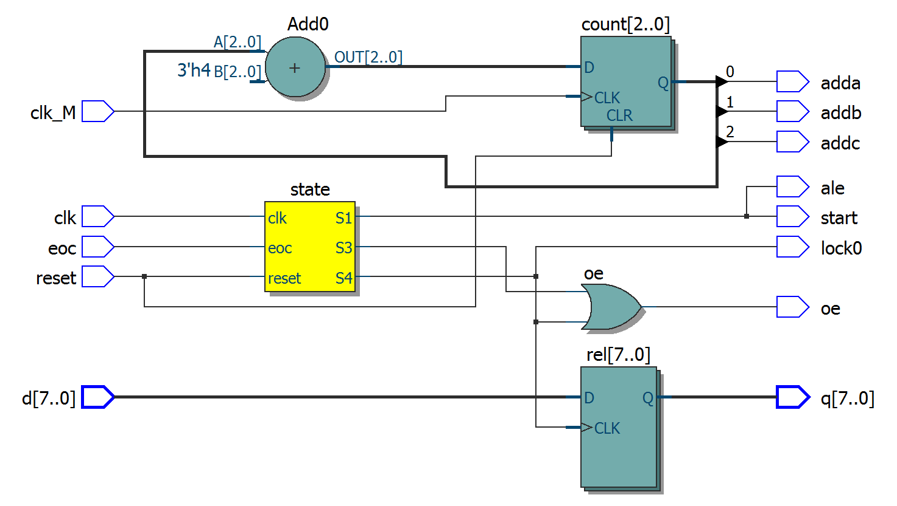
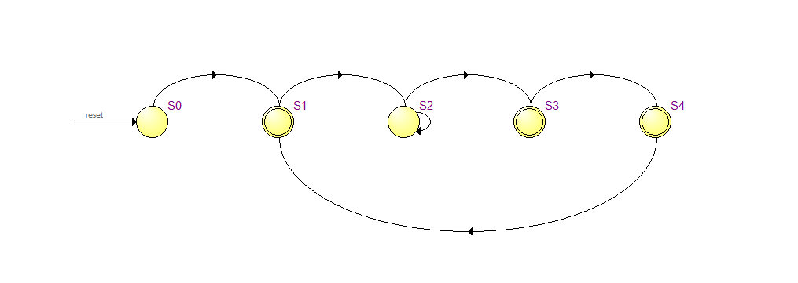

# acd0809控制电路

## 1.acd0809原理图

## 2.adc0809工作时序图

## 3.acd0809控制电路代码

    /************adc0809控制电路********************
    clk、clk_M => 时钟信号
    reset => 同步清零
	eoc => End Of Conversion转换结束，接adc0809的7引脚
	d => 8个模拟量输入端，表示IN0~IN7，接adc0809的1~5、26~28引脚
	ale => Address Latch Enable地址锁存允许信号，接adc0809的22引脚
	start => A/D 转换启动信号输入端，接adc0809的22引脚
	oe => Output Enable输出使能控制信号，接adc0809的22引脚
	adda => 地址输入线
    addb => 地址输入线
    addc => 地址输入线
	lock0 => 转换完成锁存状态显示
	q => 8个数字量输出端，表示DB0~DB7，接adc0809的8、14、15、17~21引脚,
    x => 输去信号
    z => 输出信号
    1.采用格雷编码方式（常用的有四种：顺序编码、格雷编码、热码编码、约翰逊编码）
    2.采用三段式的描述方式
    ********************************************/
    
    module fsm_adc0809_d3 (clk,clk_M,reset,eoc,d,ale,start,oe,adda,addb,addc,lock0,q);
    
    input wire clk,clk_M;
    input wire reset;
    input wire eoc;
    input wire [7:0] d;
    output reg ale;
    output reg start;
    output reg oe;
    output wire adda;
    output wire addb;
    output wire addc;
    output wire lock0;    //观察数据输出的锁存情况
    output wire [7:0] q;
    
    reg lock;    //一个数据转换完成后锁存下一个数据
    reg [2:0] state,next_state;
    reg [7:0] rel;    //寄存器，存放d=>q转换的中间态
    reg [2:0] count;    //加计数寄存器
    localparam S0=3'b000,
               S1=3'b001,
               S2=3'b011,
               S3=3'b010,
               S4=3'b110;
    
    assign lock0 = lock;
    assign q = rel;
    assign {addc,addb,adda} = count;    //通道in0~int7的数据输入。
    
    always@(posedge clk_M, posedge reset) begin    //高频时钟扫描输入端
    if(reset == 1) count <= 3'b000;
    else count <= count + 1'b1;
    end
    
    always@(posedge clk, posedge reset) begin    //现态
    if(reset == 1) state <= S0;
    else state <= next_state;
    end
    
    always@(state,eoc) begin    //次态
    case(state)
    S0: begin ale <=0; start <= 0; lock <= 0;    //初始化adc0809
        oe <= 0; next_state <= S1; end 
    S1: begin ale <=1; start <= 1; lock <= 0;    //输入数据
        oe <= 0; next_state <= S2; end 
    S2: begin ale <=0; start <= 0; lock <= 0; oe <= 0; 
        if(eoc == 1) next_state <= S3;    //转换结束
    	 else next_state <= S2; end         //转换未结束
    S3: begin ale <=0; start <= 0; lock <= 0;    //将数据传入寄存器
        oe <= 1; next_state <= S4; end 
    S4: begin ale <=0; start <= 0; lock <= 1;    //将数据锁存并输出 
        oe <= 1; next_state <= S1; end 
    default: next_state <= S0;
    endcase
    end
    
    always@(posedge lock) begin    //输出
    rel <= d;
    end
    
    endmodule
    
## 4.adc0809引脚图

## 5.adc0809RTL图

## 6.adc0809综合后的状态转换图

