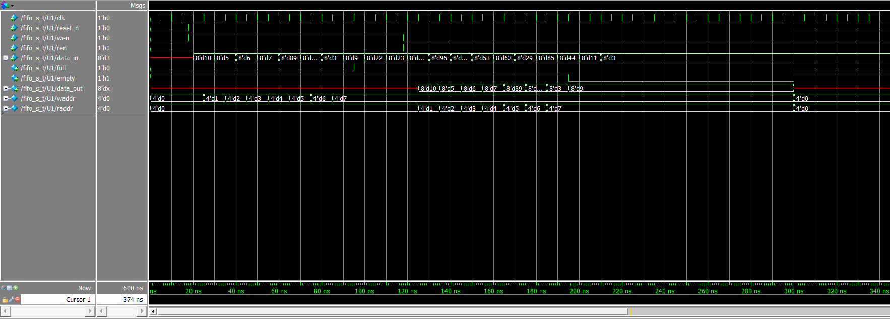

## 同步FIFO

### 1、相关概念

fifo是 first input first output 的缩写，即先进先出队列，fifo一般用作不同时钟域的缓冲器。fifo根据读和写的时钟是否为同一时钟而分为同步fifo和异步fifo。异步fifo相比同步fifo来说，设计更加复杂一点。

设计FIFO的时候一般需要考虑两点：

**1. FIFO的大小**

FIFO的大小指的是ram的大小，这个可以根据设计需要来设置。

**2. FIFO空满状态的判断**

FIFO空满状态的判断通常有两种方法。

a、异步FIFO中的ram一般是双端口ram，所以有独立的读写地址。因此可以一种是读指针，一种是写指针，读指针指向下一个要读的地址，写指针指向下一个要写入数据的地址，最后通过比较读指针和写指针的大小来确定空满状态。

b、设置一个计数器，当写使能有效的时候计数器加一；当读使能有效的时候，计数器减一，将计数器与ram的size进行比较来判断fifo的空满状态。这种方法设计比较简单，但是需要的额外的计数器，就会产生额外的资源，而且当fifo比较大时，会降低fifo最终可以达到的速度。

本项目中的FIFO为同步FIFO，采用b方法判断空与满

### 2、设计代码

    /******************************************************
    参考自：https://blog.csdn.net/buzhiquxiang/article/details/103287220
    设计者：郭琦
    fifo类型：同步fifo
    特点：1、读时钟与写时钟为同一时钟，在时钟上升沿不同时发生读写操作，读写顺序为“先写后读”；
          2、fifo在被写满后可以继续写入，从而覆盖原有数据，在写满时发出写满警告；
          3、fifo读取完成后可继续进行读操作，在读取完成时发出读完警告，读取重头开始；
          4、full=1表示写满，full=0表示写入，empty=1表示读取，empty=0表示读完；
    BUG：1、数据0，判断为空；（未修复）
    *******************************************************/
    
    module fifo_s #(parameter WIDTH=8,DEPTH=8,ADDR=3)    //宽度为8,深度为    2^7=128 
    (clk,reset_n,wen,ren,data_in,full,empty,data_out);
    
    input wire clk,reset_n;
    input wire wen,ren;                    //写使能，读使能
    input wire [WIDTH-1:0] data_in;
    output reg full,empty;                 //满、空
    output reg [WIDTH-1:0] data_out; 
    
    reg [WIDTH-1:0] memery [DEPTH-1:0];    //内存容量为:8
    reg [ADDR-1:0] waddr,raddr;            //写地址指针，读地址指针
    
    always@(posedge clk,negedge reset_n) begin   
    if(reset_n == 0) waddr = 0;
    else if(wen == 1) begin
        if((data_in != 0)&&(full != 1)) begin
            memery[waddr] = data_in;                  //写寄存器
    		waddr = waddr + 1;
    	end
        else waddr = waddr;
    end
    else waddr = waddr;
    end
    
    always@(posedge clk,negedge reset_n) begin    
    if(reset_n == 0) raddr = 0;
    else if(ren == 1) begin
        if((memery[raddr] != 0)&&(empty != 0)) begin
          data_out = memery[raddr];                //读寄存器
    		raddr = raddr + 1;
        end
        else raddr = raddr;
    end
    else raddr = raddr;
    end
    
    always@(posedge clk,negedge reset_n) begin    //判断是否写满
    if(reset_n == 0) full = 0;
    else if(waddr == DEPTH) begin
        full = 1;
        waddr = 0;
    end
    else full = 0;
    end
    
    always@(posedge clk,negedge reset_n) begin    //判断是否读完
    if(reset_n == 0) empty = 1;
    else if(raddr==DEPTH) begin
        empty = 0;
        raddr = 0;
    end
    else empty = 1;
    end
    
    endmodule

### 3、测试代码

    `timescale 1ns/1ns
    module fifo_s_t();
    
    parameter WIDTH=8,DEPTH=8,ADDR=4;
    reg clk,reset_n,wen,ren;
    reg [WIDTH-1:0] data_in;
    wire full,empty;
    wire [WIDTH-1:0] data_out;
    
    fifo_s #(WIDTH,DEPTH,ADDR) U1 (clk,reset_n,wen,ren,data_in,full,empty,    data_out);
    
    always #5 clk=~clk;
    
    initial begin
    clk = 0;
    reset_n = 0;
    wen = 0;
    ren = 0;
    #18
    reset_n = 1;
    wen = 1;
    ren = 0;
    #100
    wen = 0;
    ren = 1;
    #182
    reset_n = 0;
    end
    
    initial begin
    #20 data_in = 10;
    #10 data_in = 5;
    #10 data_in = 6;
    #10 data_in = 7;
    #10 data_in = 89;
    #10 data_in = 125;
    #10 data_in = 3;
    #10 data_in = 9;
    #10 data_in = 22;
    #10 data_in = 23;
    #10 data_in = 220;
    #10 data_in = 96;
    #10 data_in = 155;
    #10 data_in = 53;
    #10 data_in = 62;
    #10 data_in = 29;
    #10 data_in = 85;
    #10 data_in = 44;
    #10 data_in = 11;
    #10 data_in = 3;
    end
    
    endmodule

### 4、Modelsim仿真

### 5、RTL图

参考文献：

1. [同步FIFO与异步FIFO](https://blog.csdn.net/buzhiquxiang/article/details/103287220)

