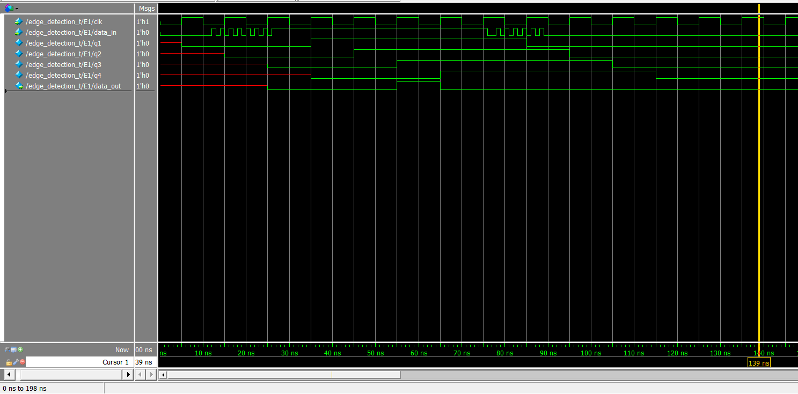
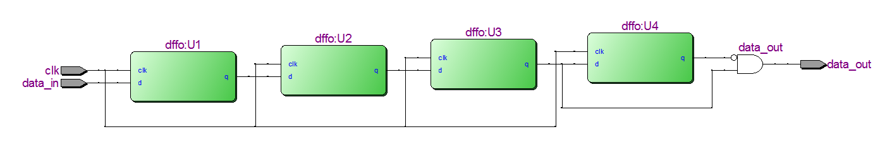

## 边沿检测电路

### 1、概念介绍

边沿检测，就是检测输入信号或者FPGA内部逻辑信号的跳变，即检测信号的上升沿或下降沿，检测到边沿后，产生一个高电平的脉冲。

### 2、本模块特点

1. 用到了4个D触发器，U1对信号采样，U2、U3、U4对信号分别延时一个时钟周期。
2. 通过U3和U4的输出检测上升沿，即q3&~q4。
3. U2去掉也并无大碍。

### 3、设计代码

    /***************边沿检测电路*********************
    设计者：郭琦
    设计时间：2021/03/23
    说明：1、用到了4个D触发器，U1对信号采样，U2、U3、U4对信号分别延时一个时钟周期。
          2、通过U3和U4的输出检测上升沿，即q3&~q4。
    	  3、U2去掉也并无大碍。
    ***************************************************/
    module edge_detection(clk,data_in,data_out);
    
    input clk;
    input data_in;
    output data_out;
    
    wire q1,q2,q3,q4;
    
    dffo U1 (clk,data_in,q1, );
    dffo U2 (clk,q1,q2, );
    dffo U3 (clk,q2,q3, );
    dffo U4 (clk,q3,q4, );
    
    assign data_out = q3&~q4;
    
    endmodule
    
    
    /****************D触发器************************
    设计者：郭琦
    设计时间：2021/03/23
    特点：不带置位
    ***************************************************/
    module dffo(clk,d,q,q_n);
    
    input wire clk,d;
    output reg q,q_n;
    
    always@(posedge clk)
     begin
    	q<=d;
        q_n<=~d;
     end
    
    endmodule

### 4、仿真代码

    `timescale 1ns/1ns
    module edge_detection_t();
    
    reg data_in,clk;
    wire data_out;
    
    edge_detection E1 (clk,data_in,data_out);
    
    always #10 clk=~clk;
    
    initial begin
    clk=0;
    data_in=0;
    end
    
    initial begin
    #12 data_in = 1;
    #1 data_in = 0;
    #1 data_in = 1;
    #1 data_in = 0;
    #1 data_in = 1;
    #1 data_in = 0;
    #1 data_in = 1;
    #1 data_in = 0;
    #1 data_in = 1;
    #1 data_in = 0;
    #1 data_in = 1;
    #1 data_in = 0;
    #1 data_in = 1;
    #1 data_in = 0;
    #1 data_in = 1;
    #50 data_in = 0;
    #1 data_in = 0;
    #1 data_in = 1;
    #1 data_in = 0;
    #1 data_in = 1;
    #1 data_in = 0;
    #1 data_in = 1;
    #1 data_in = 0;
    #1 data_in = 1;
    #1 data_in = 0;
    #1 data_in = 1;
    #1 data_in = 0;
    #1 data_in = 1;
    #1 data_in = 0;
    end
    endmodule

### 5、Modelsim仿真

### 6、RTL图

参考文献：

1. [FPGA基础入门篇(四) 边沿检测电路](https://blog.csdn.net/vivid117/article/details/90757350)

2. [FPGA基础入门篇(六) 按键防抖电路实现（一）](https://blog.csdn.net/vivid117/article/details/91128571?utm_medium=distribute.pc_relevant.none-task-blog-2~default~BlogCommendFromMachineLearnPai2~default-11.control&dist_request_id=1328731.37.16167339083438811&depth_1-utm_source=distribute.pc_relevant.none-task-blog-2~default~BlogCommendFromMachineLearnPai2~default-11.control)